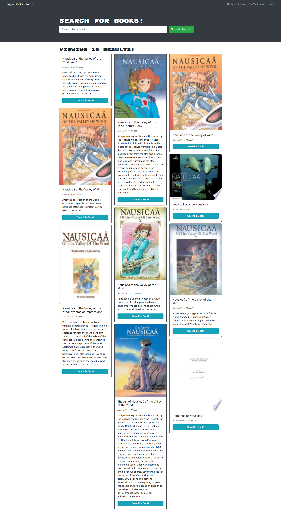

 

## **book search engine** 
 

[https://fathomless-depths-63624.herokuapp.com/](https://fathomless-depths-63624.herokuapp.com/) 
 

## description

***
As an avid reader I want to be able to search for new books to read, so that I can keep a list of books to purchase. 
Book Search Engine App answers this need and presents an easy to use UI. This app was transformed from a fully functioning Google Books API search engine built with a RESTful API to a GraphQL API built with Apollo Server. The app was developed using the MERN stack with a React front end, MongoDB database, and Node.js/Express.js server and API. It's already set up to allow users to save book searches to the back end. The app was deployed to Heroku through MongoDB Atlas.  
 
 

## acceptance criteria

***

GIVEN a book search engine: 

* WHEN I load the search engine; THEN I am presented with a menu with the options Search for Books and Login/Signup and an input field to search for books and a submit button. 

* WHEN I click on the Search for Books menu option; THEN I am presented with an input field to search for books and a submit button. 

* WHEN I am not logged in and enter a search term in the input field and click the submit button; THEN I am presented with several search results, each featuring a book’s title, author, description, image, and a link to that book on the Google Books site. 

* WHEN I click on the Login/Signup menu option; THEN a modal appears on the screen with a toggle between the option to log in or sign up. 

* WHEN the toggle is set to Signup; THEN I am presented with three inputs for a username, an email address, and a password, and a signup button. 

* WHEN the toggle is set to Login; THEN I am presented with two inputs for an email address and a password and login button. 

* WHEN I enter a valid email address and create a password and click on the signup button; THEN my user account is created and I am logged in to the site. 

* WHEN I am logged in to the site; THEN the menu options change to Search for Books, an option to see my saved books, and Logout. 

* WHEN I am logged in and enter a search term in the input field and click the submit button; THEN I am presented with several search results, each featuring a book’s title, author, description, image, and a link to that book on the Google Books site and a button to save a book to my account. 

* WHEN I click on the Save button on a book; THEN that book’s information is saved to my account. 

* WHEN I click on the option to see my saved books; THEN I am presented with all of the books I have saved to my account, each featuring the book’s title, author, description, image, and a link to that book on the Google Books site and a button to remove a book from my account. 

* WHEN I click on the Remove button on a book; THEN that book is deleted from my saved books list. 

* WHEN I click on the Logout button; THEN I am logged out of the site and presented with a menu with the options Search for Books and Login/Signup and an input field to search for books and a submit button. 
 
 

## usage

***

Screenshots that shows the fully generated web pages: 
 

 
 
 

 
 
 

## some valuable references

***

These notes and links are listing some valuable references among others that I used doing this homework: 
 

[https://www.apollographql.com/docs/apollo-server/getting-started/](https://www.apollographql.com/docs/apollo-server/getting-started/)

[https://www.apollographql.com/docs/react/data/mutations/](https://www.apollographql.com/docs/react/data/mutations/)

[https://www.apollographql.com/docs/react/local-state/local-state-management/](https://www.apollographql.com/docs/react/local-state/local-state-management/)

[https://www.apollographql.com/docs/apollo-server/security/authentication/](https://www.apollographql.com/docs/apollo-server/security/authentication/)

[https://www.altexsoft.com/blog/nosql-pros-cons/](https://www.altexsoft.com/blog/nosql-pros-cons/)

[https://www.howtographql.com/basics/1-graphql-is-the-better-rest/](https://www.howtographql.com/basics/1-graphql-is-the-better-rest/)

[https://graphql.org/blog/rest-api-graphql-wrapper/](https://graphql.org/blog/rest-api-graphql-wrapper/)

[https://blog.bitsrc.io/migrating-existing-rest-apis-to-graphql-2c5de3db647d](https://blog.bitsrc.io/migrating-existing-rest-apis-to-graphql-2c5de3db647d)

[https://graphql.org/graphql-js/mutations-and-input-types/](https://graphql.org/graphql-js/mutations-and-input-types/)

[https://www.mongodb.com/cloud/atlas](https://www.mongodb.com/cloud/atlas)

[https://developers.google.com/books/docs/v1/using](https://developers.google.com/books/docs/v1/using)

[https://itqna.net/questions/5973/search-details-book-google-books-api-php](https://itqna.net/questions/5973/search-details-book-google-books-api-php)

[https://spec.graphql.org/June2018/](https://spec.graphql.org/June2018/)

[https://reactjs.org/docs/hooks-intro.html](https://reactjs.org/docs/hooks-intro.html)

[https://reactrouter.com/](https://reactrouter.com/)

[https://blog.logrocket.com/how-react-hooks-can-replace-react-router/](https://blog.logrocket.com/how-react-hooks-can-replace-react-router/)

[https://dmitripavlutin.com/javascript-and-or-logical-operators/](https://dmitripavlutin.com/javascript-and-or-logical-operators/)

 
 